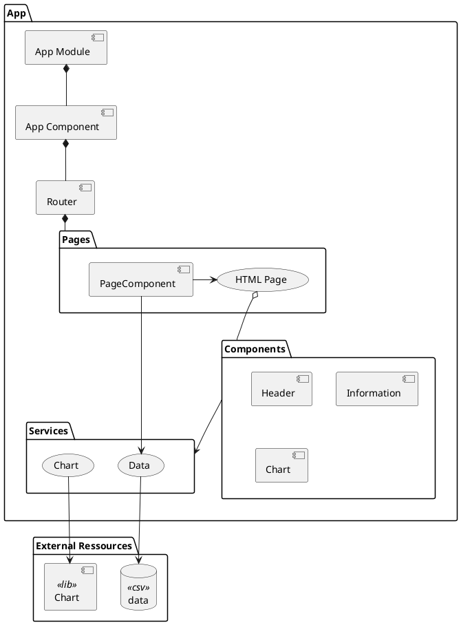

# Olympic game starter


This app allows users to browse data about olympic games : 

- participating countries ( nb of athletes )
- and their results ( nb of medals )

Two main pages are available :

- homepage : gives an overview of medals per country
- country detail : gives precise informations for a country

## Architecture



## Description

### App module

Bootstraps the application and launchs the [App component](#app-component)

### App component

Contains the global layout and contains the [router component](#router)

### Router

Calls the right component for the requested page

### Pages Folder

Gets data from data service, and call components to display HTML

Pages :
    - can access the `data` service to fetch / push data
    - are made of components ( but can contain specific HTML )

### Components folder

Contains autonomous and reusable HTML

Components :
    - can access `services`
    - are made of HTML and can contain other components too

### Models folder and types

Models will cary persistable data trough the application.

#### Types

Create the types close too the service who will use it mainly.

### Services

Contains the application logic.

Services can access :
    - app dependencies
    - external API

> Using services allows to decouple the application from the external services. If the external service change, modifications are made only in the service and the app code is unchanged

## Tech

### Stack

- [Angular 18](https://v18.angular.dev/overview)
- [chart.js](https://www.chartjs.org)

### Installation

```bash
# install dependencies
npm install
# launch dev server
npm start # runs ng serve

# build app
npm run build # runs ng build
```