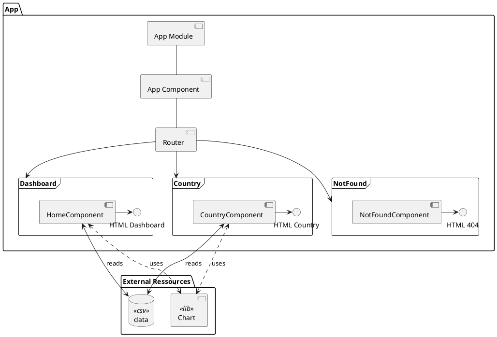
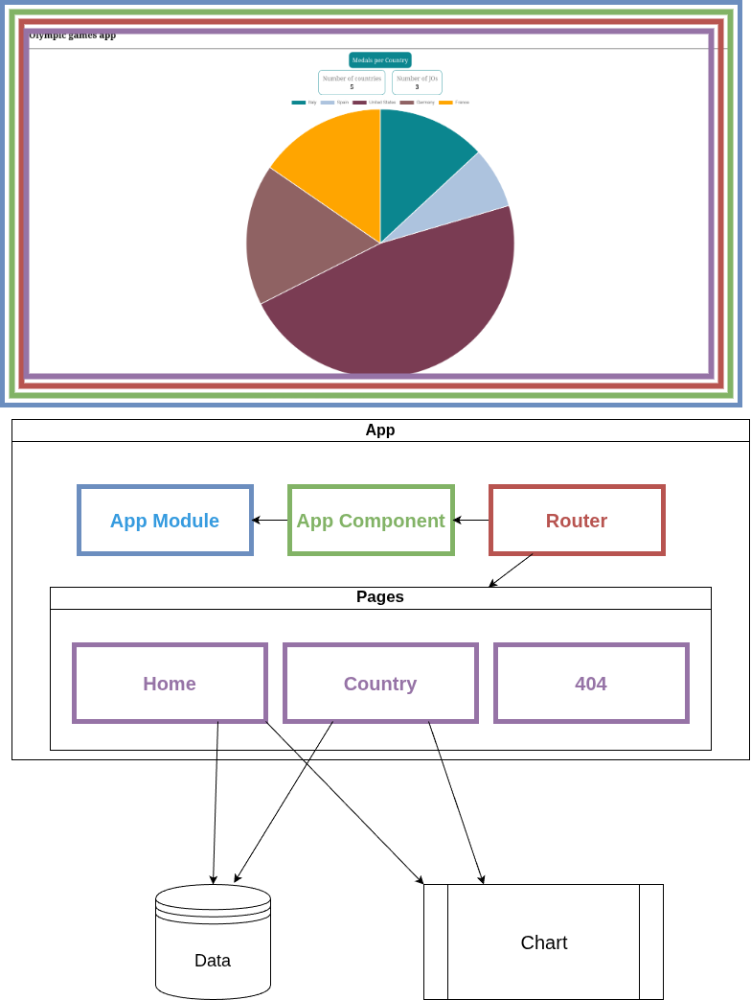
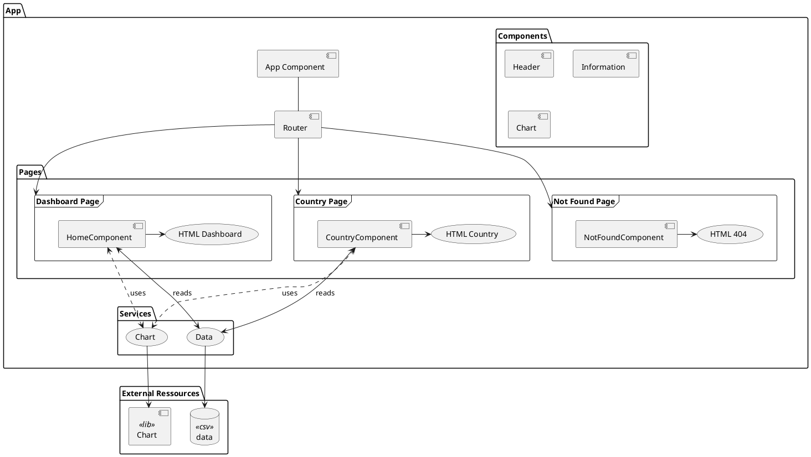
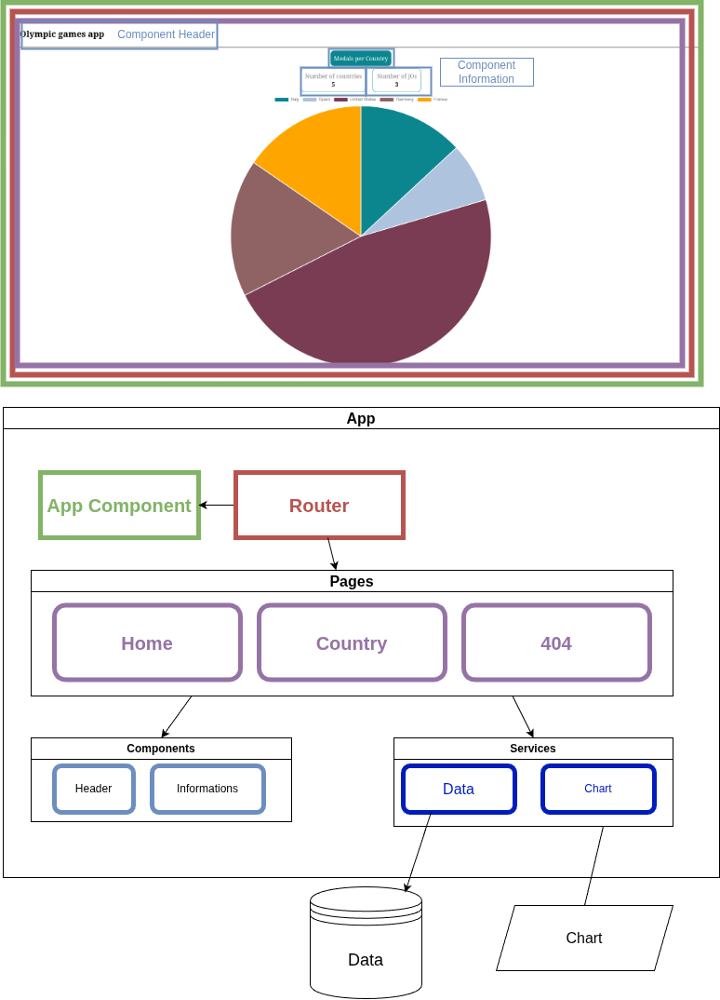

# Notes sur l'architecture

## Step 1 : analyse




Les problèmes rencontrés :

- duplication de code
    - récupération des données `this.http.get<any[]>(this.olympicUrl).pipe().subscribe(` 
- couplage
    - couplage fort entre l'application et le composant de Chart (utilisation directe par les pages)
- organisation du code
    - revoir l'arborescence
    - refactorisation
    - fichiers component volumineux, code à factoriser
    - les données de pays sont récupérées directement dans les pages
    - le fichier de data est dans assets ( disponible directement en téléchargement )
- obsolescence
    - l'utilisation de subscribe est dépréciée ( HomeComponent:24 )
    - l'utilisation des modules est [déprécié](https://angular.dev/guide/ngmodules/overview)
    - utilisation de console.log ( HomeComponent:26 ) pour debug
    - 56 vulnerabilités dans les node_modules dont 39 high    
- Angular
    - utilisation du type `any` déconseillée
    - version obsolète de Angular ( v18 vs v21 actuellement )
- UX
    - il n'existe pas de demi médaille ( sur pays "Espagne" ) => composant chart à configurer ?
    - absence de header ( pour avoir le nom de l'app sur le détail d'un pays )
    - absence de navigation

## Step 2 : proposition

La nouvelle arborescence permettra de mieux organiser le code pour les évolutions futures et la maintenabilité.
En autre les points suivants sont appliqués

- Ajout de models pour manipuler les données
- Ajout de types
- Séparation du code des composants, pages, models, services et types
- Si possible avec cette version d'Angular, suppression du module app 
- création de services pour :
    - la gestion des charts 
        - création d'une [`factory`](https://refactoring.guru/design-patterns/factory-method) qui utilisera le composant externe chart
        - cela permettra de centraliser la communication avec le composant externe chart
    - la récupération des données
        - cela permettra de modifier uniquement ce service lors du passage à une API 
        - création d'un [`singleton`](https://refactoring.guru/design-patterns/singleton)
- création de composants pour 
    - l'affichage des charts, ils utiliseront le chartService
    - le header, qui sera inclus dans toute les pages
    - les pastilles d'informations ( nombre de pays, etc )
- création d'un type 'title' ( texte uniquement ), 'data' ( texte + nombre ) pour les pastilles
- création de models pour manipuler les données dans l'application
    - competition (id, year, city )
    - country ( id, name )
    - participation ( Country, Competition, medalCount, athleteCount )





L'arborescence suivante est proposée :

```raw
src/
    index.html
    main.ts
    styles.scss
    app/
        router.js
        components/
            header/
            information/ ( eg : number of countries )
        pages/
            countryDetail/
            dashboard/
            notFound/
        models/
            competitions.ts
            countries.ts
            participations.ts
        services/
            data.ts
            chart.ts
        types/
            chartType.ts
```

La migration vers la nouvelle architecture se fera étape par étape avec des tests et un commit à chaque étape si possible :

- création des modèles et types ( si nécessaire )
- création des services
- utilisation des modèles et types
- création des composants
- utilisation des composants

## Step 3
